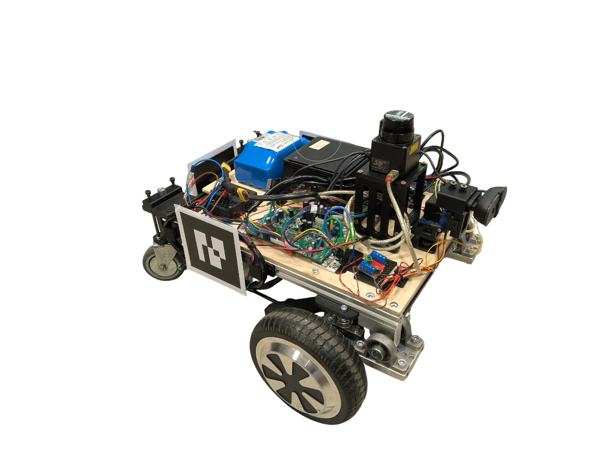

# Praca Inżynierksa, Projekt RZUF
### **R.Z.U.F** - **Roboty Zwarcie Utrzymujące Formację**
###### Brak polskich znakow wynika z zdalnego opracowywania projektu przy uzyciu VNC

Celem pracy było opracowanie projektu oraz wykonanie grupy robotów mobilnych, wraz z układem sterowania i komunikacji umożliwiającym ich skoordynowany ruch. W ramach realizacji zaprojektowano mobilnego robota kołowego, zdolnego do współpracy, a następnie zbudowano i przetestowano grupę takich jednostek. Do koordynacji ruchu przyjęto konfigurację lider-naśladowca, w której roboty wykorzystują kamerę do identyfikacji pozycji lidera przy pomocy markera AR. Konstrukcja została przystosowana do pracy w zrónicowanym terenie dzięki autorskiemu układowi amortyzacji. Praca obejmuje przeględ literatury, projekt mechaniczny, elektroniczny oraz implementację oprogramowania w systemie ROS, a także badania eksperymentalne potwierdzające zdolnosc zbudowanych robotów do współpracy.

The aim of this thesis was to design and build a group of mobile robots, along with a control and communication system enabling their coordinated movement. As part of the project, a wheeled mobile robot capable of cooperation was designed, followed by the construction and testing of a group of such units. To coordinate their movement, a leader-follower configuration was adopted, in which the robots use a camera to identify the leader's position by means of an AR marker. The mechanical design was adapted for operation in varied terrain through the use of a custom-built suspension system. The work includes a literature review, mechanical and electronic design, implementation of software in the ROS environment, as well as experimental research confirming the ability of the constructed robots to cooperate.

Uklad sterowania oparty zostal o wykorzystanie zhakowanej plyty glownej z deski elektrycznej hoverboarda oraz sterownikow do niej:
- [https://github.com/hoverboard-robotics/hoverboard-driver]
- [https://github.com/EFeru/hoverboard-firmware-hack-FOC]

Schemat ukladu podlaczenia:

Architektura ROS projektu:

---
### Potrzebna instalcja ROS
Zainstalowany system operacyjny to Ubuntu 20.04 ze wzgledu na wykorzystanie ROS Noetic. Na kazdym z uzytych komputerow zostala zainstalowana pelna wersja ubuntu oraz zgodnie z instrukcja [https://wiki.ros.org/noetic/Installation/Ubuntu] pelna wersja ROSa (ros-noetic-desktop-full)

Dodatkowy potrzebne zewnetrzne oprogramowanie:
-       sudo apt install python-is-python3
-       sudo apt-get install v4l-utils
Reszta ROSowa powinna zostac zainstalowana po *rosdep install*

---

### Kopiowanie projektu
Mysla przewodnia tego kopiowania, jest przeniesienie wszystkich paczek istniejacych w orginalnym projekcie rzuf

Pierwszy krok to utworzenie nowego workspace'a

        mkdir catkin_ws/src
        cd catkin_ws
        catkin_make

Następnie w innym miejscu nalezy zrobic tymczasowe foldery w celu przyszlego przeniesienia odpowiedniego folderu

        mkdir ~/rozne/temp
        cd ~/rozne/temp
        git clone https://github.com/Prospeross/rzuf.git
        cd rzuf/src
        rm CMakeList.txt

Zapisac bezwgledna sciezke do tego miejsca, przy uzyciu komendy:

        pwd

Wrocic do poprawnego nowo stworzonego workspaca:

        cd ~/droga/do/catkin_ws/src

Skopiowac tymczasowo utworzone rzuf/src:

        cp <co i skad> <gdzie skopiowac>

        cp ~/rozne/temp/rzuf/src/* .

Gwiazdka ozancza wszyskto z folderu src/

Kropka oznacza ze do aktualnej sciezki (Tak mozna zrobic jesli sie przeszlo do catkin_ws/src)

Alternatywa samego kopiowania:

        cp ~/rozne/temp/rzuf/src/* ~/droga/do/catkin_ws/src/

---

#### Alternatywa kopiowania projektu
Nie zostalo to sprawdzone ale potencjalnie mozna w nowo stworzonym workspasie usunac to co powtarza sie na repo, a potem tylko skopiowac w tej lokalicacji

Utworzenie nowego workspace'a:

        mkdir catkin_ws/src
        cd catkin_ws
        catkin_make
Usuniecie tego co sie powtarza:

        rm -rf src
        rm CMakeList.txt
        rm -f .catkin_workspace

Skopiowanie:

        git clone https://github.com/Prospeross/rzuf.git
Zbudowanie i sorsowanie:

        catkin_make
        source devel/setup.bash

**MOZLIWE**, ze to dzial.

---
Po poprawnym skopiowaniu wszyskitch paczek, nalezy wykonac komende instalujaca wszystkie zalezne biblioteki, przy uzyciu komendy:

                rosdep install --from-paths src --ignore-src -r -y

**UWAGA**, sam akurat nie testowalem czy tylko tyle wystarczy, teoretycznie powinno, natomiast w moim przypadku zapomnialem o tej komendzie jak jej najbardziej potrzebowalem.

Podczas przygotowywania robotow do badania, robi doklanie to co opisane wyzej, natomiast z zaleznosci instalowalem recznie, oto zaleznosci ktore musialem doinstalowywac:
-       sudo apt-get install ros-noetic-rosparam-shortcuts
-       sudo apt-get install v4l-utils
-       sudo apt-get install ros-noetic-usb-cam
-       sudo apt-get install ros-noetic-urg-node
-       sudo apt-get install ros-noetic-rosserial
-       sudo apt-get install ros-noetic-rosserial-arduino
-       sudo apt-get install ros-noetic-video-stream-opencv
-       sudo apt install python-is-python3

Paczki ar_track_alvar oraz ar_track_alvar_msgs sa lokalnie w projekcie ze wzgledu na problemy jak mialy byc w wspolnym zasobie bibliotek.

Paczka hoverboard_driver jest poprostu lokalna

Po wiecej informacji siegac do folderu **Instrukcje**